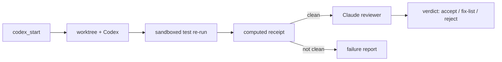

# codex-bridge

Use OpenAI Codex from inside Claude Code without having to trust what Codex says it did.

codex-bridge is a Claude Code mod with two lanes:

- **Ask / gate.** One tool call sends Codex a question or a read-only critique of a diff. The answer comes back
  with a *grounding receipt*: proof (by a random-line read canary per file) that Codex actually read the files it
  was pointed at, the model and effort used, and the Codex quota it cost.
- **Worker jobs.** Codex builds a change in an isolated git worktree. When it finishes, the bridge re-runs your
  tests in a sandbox (no network, no secrets, writes limited to the worktree), computes what really changed,
  compares that with what Codex claimed, and, if everything checks out, has a read-only Claude reviewer judge the
  diff against your definition of done. You get a verdict. Nothing is ever merged or committed for you.



The point is that every claim you act on is either **computed** by the bridge or **tagged as Codex's (or the
reviewer's) words**. A worker that says "all 12 tests pass" is checked against a re-run it could not touch.

## Requirements

| | |
|---|---|
| Claude Code | 2.1.287 or later (mods / hooks modules) |
| Codex CLI | 0.159 or later, logged in (`codex login`) |
| Python | 3.11 or later on `PATH` as `python3`, `python` or `py -3` (stdlib only, nothing to install) |
| git | any recent version (worker jobs use `git worktree`) |

**Platforms.** Ask and gate work wherever Codex runs. Worker jobs are unlocked per machine only after
`/codex-bridge setup` proves the verify sandbox works there (see [Security](SECURITY.md)). The sandbox has been
proven on **macOS**. Linux and Windows have code paths and unit tests but no proven sandbox run yet; on those,
setup tells you whether workers unlock.

## Install

In a Claude Code terminal session:

```text
/plugin install codex-bridge --marketplace projectsofwill/codex-bridge
```

Answer `y` to add the marketplace, then pick a scope (user scope is the usual choice). Then run the one-time
check:

```text
/codex-bridge setup
```

Setup finds Python, validates your config (if you have one), reads your Codex usage limits, and runs the sandbox
selftest. Each selftest probe is reported: things that must fail (writing outside the worktree, reading `.env`,
reaching the network, seeing a secret environment variable) and things that must work. Worker jobs stay locked on
a machine until its selftest passes, and the proof is tied to the Codex CLI version, so a Codex upgrade asks for
it again.

## Using it

You mostly talk to Claude as usual; Claude calls the tools. The tools:

| Tool | What it does |
|---|---|
| `codex` | `mode: "ask"` for a second opinion, `mode: "gate"` for a grounded critique of a literal diff. A gate call names its `trigger` (the stakes: `irreversible`, `trust-boundary`, `unattended`, `policy`), which picks the model and effort. |
| `codex_start` | Start a worker job: task, scope, verify command, risk tier (`R0`/`R1`/`R2`), definition of done, the test files the verify run trusts, and a short written judgment that the task is safe to delegate. Returns at once; the job runs detached and survives the session. |
| `codex_status` | Jobs, the Codex slot holder, live usage limits. |
| `codex_result` | A job's receipt (computed vs claimed) and review verdict. |
| `codex_cancel` | Stop a pending or running job. Its worktree is kept. |
| `codex_discard` | Remove a finished job's worktree, after you merged or rejected it. |
| `codex_diagnose` | Run the reviewer on a job that did *not* come out clean: defect, bad test, or spec conflict? |

And one slash command for you:

```text
/codex-bridge setup | status | result <job_id> | cancel <job_id>
```

A band above the prompt shows running jobs and an in-flight ask, plus your Codex limits once a window passes 70%.

### What "clean" means

A worker job is `clean` only when **all** of these hold: Codex exited normally, the change scan completed, the
sandboxed test re-run passed with at least one test executed, its result matches what Codex claimed, nothing was
written outside the declared scope, no unexpected ignored files appeared, and the test files you listed were not
changed (unless you allowed it, in which case the reviewer must account for every changed test). Anything else
gets a specific outcome: `verify-failed`, `mismatch`, `out-of-scope`, `verifier-modified`, `incomplete-scan`,
`timeout`, `crashed`, `refused`.

Only clean jobs get an automatic review. The reviewer is read-only (Read, Grep, Glob), reviews an immutable packet,
and must return a requirement-by-requirement verdict bound to a hash of the exact diff it saw. An `accept` with an
unmet requirement or an undisposed test change is downgraded to `fix-list` in code. `accept` means "recommend
merge"; merging is yours.

### Review depth by tier

| Tier | Default model / effort | Auto-review |
|---|---|---|
| R0 (mechanical) | standard / medium | none: the receipt and re-run are the check (Sonnet if tests changed) |
| R1 (judgment) | standard / medium | Sonnet |
| R2 (correctness-critical) | standard / high | Opus |

## Configuration

Everything has a default. To change it, create `~/.codex-bridge/config.json` with only the keys you want to
override (unknown keys are refused, and a malformed file refuses every command rather than silently running a
policy you didn't write). Changes apply at the next session start; `/codex-bridge setup` validates the file.

```json
{
  "models": { "cheap": "gpt-6-luna", "standard": "gpt-6.1-sol", "strong": "gpt-6-astra" },
  "stakes": {
    "irreversible": ["standard", "high"],
    "trust-boundary": ["standard", "high"],
    "unattended": ["standard", "medium"],
    "policy": ["standard", "medium"]
  },
  "stakes_aliases": { "backbone": "unattended" },
  "tiers": { "R0": ["standard", "medium"], "R1": ["standard", "medium"], "R2": ["standard", "high"] },
  "review": { "R0": "none", "R1": "sonnet", "R2": "opus" },
  "protected_paths": ["infra/", "deploy.yaml"],
  "workspace_roots": ["~/work"],
  "log_path": null,
  "worker_refuse_pct": { "primary": 70, "secondary": 85 }
}
```

| Key | Meaning |
|---|---|
| `models` | Model ids for three roles. `cheap` may only run worker jobs (whose work is verified and reviewed); gates never run below `standard`. |
| `stakes` | Gate stakes → `[role, effort]`. A gate call must name the stakes that make it a gate. |
| `stakes_aliases` | Your own names for stakes (e.g. your team calls it "backbone"). |
| `tiers` | Worker tier → `[role, effort]`. Claude may raise a model or effort, never lower it. |
| `review` | Reviewer per tier: `none`, `sonnet` or `opus`. |
| `protected_paths` | Added to the built-in list (`.claude/`, `.codex/`, `.github/workflows/`, `AGENTS.md`, `CLAUDE.md`, `.mcp.json`, settings files). A worker may read these but not write them; it can propose an edit as a separate patch that is shown, never applied. `dir/` is a prefix, anything else a file name. You can add, never remove. |
| `workspace_roots` | Extra directories the verify sandbox denies and whose protected areas also apply. |
| `log_path` | Where the per-call cost log (JSONL) goes. Default `~/.codex-bridge/burn.jsonl`. |
| `worker_refuse_pct` | Refuse a new worker above this % of the 5-hour (`primary`) or weekly (`secondary`) Codex window, until 3 measured runs exist; after that the bridge refuses when the median measured cost won't fit. |

Environment overrides: `CODEX_BRIDGE_HOME` (state directory, default `~/.codex-bridge`), `CODEX_BRIDGE_CONFIG`
(config path), `CODEX_BRIDGE_CODEX` (the `codex` binary).

## Limits and honest caveats

- **One Codex dispatch at a time per machine.** Bridge calls queue on a lock (an ask waits up to 2 minutes, then
  refuses). Codex you run by hand, other tools that run Codex, and other machines are **not** coordinated.
- **The worker's own read access is restricted by prompt, not sandbox.** Its writes go to an isolated worktree and
  are scope-checked afterwards, and the test re-run *is* sandboxed, but while Codex works it can read what your
  user can read. See [SECURITY.md](SECURITY.md).
- **Grounding is evidence, not proof of review.** The read canary shows Codex opened the file; it can't show Codex
  thought hard about it.
- **Usage limits are read from an experimental Codex endpoint.** If the read fails, limits show as unknown and
  nothing is blocked on them except an already-hit limit.
- **Process cleanup is best-effort.** At the end of a job the bridge kills Codex's process tree and orphaned
  processes born during the run inside the worktree. Don't start long-running processes inside a running job's
  worktree.
- Nothing is merged, committed, pushed or chained automatically.

## How it compares

[openai/codex-plugin-cc](https://github.com/openai/codex-plugin-cc) is OpenAI's own Claude Code plugin for
delegating to Codex, and the natural first choice for most people. codex-bridge is narrower and stricter: it
assumes you want to *verify* delegated work before trusting it, so it adds worktree isolation, a sandboxed re-run,
computed receipts, protected paths, stakes-based model choice and a tiered Claude review. If you don't need those,
the official plugin is simpler.

## More

- [docs/design.md](docs/design.md): how it works, state machine, and the reasons behind the rules.
- [docs/benchmark.md](docs/benchmark.md): the head-to-head runs the design was tuned on.
- [SECURITY.md](SECURITY.md): what leaves your machine, what the sandbox guarantees, how to report a vulnerability.

## Development

```bash
cd plugins/codex-bridge
python3 -m unittest discover -s bridge/tests   # core, offline (a fake codex binary)
claude plugin test .                            # the mod layer
claude plugin validate .
```

## License

Apache-2.0. See [LICENSE](LICENSE) and [NOTICE](NOTICE).
