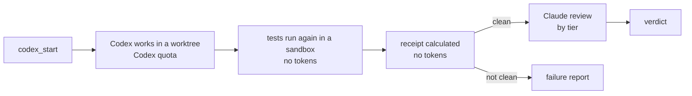

# codex-bridge

codex-bridge lets Claude Code send work to OpenAI Codex. It checks the work before you use it.

codex-bridge starts from the same idea as OpenAI's [codex-plugin-cc](https://github.com/openai/codex-plugin-cc).
If you know that plugin, you know the basics. The same ground rules apply. Codex uses your account and your usage
limits. Codex can read the files that your user account can read.

codex-bridge adds these seven improvements:

1. **Claude calls Codex directly.** Codex is a set of tools that Claude uses during a task. You do not type slash
   commands. No relay subagent copies the answer between Codex and Claude.
2. **Workers do not change your checkout.** Each job runs in a separate git worktree. codex-bridge does not merge,
   commit or push the changes.
3. **codex-bridge checks the claims of Codex.** After a worker job, codex-bridge runs your tests again in a sandbox.
   The sandbox has no network, no secrets, and write access to the worktree only. codex-bridge calculates the real
   changes and compares them with the claims of Codex.
4. **The review agrees with the risk.** A clean job gets a read-only Claude review against your definition of done.
   Mechanical work gets no review. Judgment work gets a Sonnet review. Critical work gets an Opus review.
5. **Critiques show proof of reading.** For each file in a gate (critique) call, Codex must quote one random line.
   This shows that Codex read the file. The reply also shows the quota that the call used.
6. **The risk sets the model.** codex-bridge selects the Codex model and effort from the risk of the task. Claude can
   increase them. Claude cannot decrease them. codex-bridge checks your usage limits before a job starts.
7. **Runs go in parallel.** Asks and gates do not wait. Up to three worker jobs can run at the same time. You can
   change this limit.

| | codex-plugin-cc | codex-bridge |
|---|---|---|
| Who calls Codex | you, with slash commands | Claude, with tools, during a task (and `/codex-bridge` for you) |
| Relay subagent | yes (rescue) | none |
| Where Codex writes | your checkout | a separate worktree |
| Work check | none | sandboxed test run, calculated receipt, Claude review by tier |
| Model choice | you select | from the risk; Claude can only increase it |
| Send a session to Codex | `/codex:transfer` | not available |

**Token cost.** No relay subagent uses tokens. A separate reviewer does the review. Thus, your main session does not
read each diff again on later turns. The checks also make the low-cost Codex model safe for worker jobs. In our
benchmark, that model matched the standard model and used about a quarter of the quota. We did not compare
codex-bridge directly with codex-plugin-cc. Refer to [the benchmark](docs/benchmark.md).

This diagram shows a worker job. An ask or a gate is one Codex call. Only Codex and the Claude review use tokens.
codex-bridge runs the tests and calculates the receipt in Python, without a model.



## Requirements

| Item | Requirement |
|---|---|
| Claude Code | 2.1.287 or later (mods / hooks modules) |
| Codex CLI | 0.159 or later, with a login (`codex login`) |
| Python | 3.11 or later on `PATH` as `python3`, `python` or `py -3` (standard library only) |
| git | a recent version (worker jobs use `git worktree`) |

**Platforms.** Asks and gates work on all platforms where Codex runs. Worker jobs work on a machine only after
`/codex-bridge setup` proves the sandbox on that machine. Refer to [SECURITY.md](SECURITY.md). We proved the sandbox
on macOS. Linux and Windows have code and unit tests, but we did not prove the sandbox on them. On these platforms,
setup tells you if worker jobs can run.

## Install

1. In a Claude Code terminal session, type this command:

   ```text
   /plugin install codex-bridge --marketplace projectsofwill/codex-bridge
   ```

2. Type `y` to add the marketplace.
3. Select a scope. The user scope is the usual selection.
4. Run the one-time check:

   ```text
   /codex-bridge setup
   ```

Setup finds Python, validates your configuration file, reads your Codex usage limits, and runs the sandbox
selftest. The output shows the result of each selftest probe. Some probes must fail: a write outside the worktree,
a read of `.env`, a network connection, and a read of a secret environment variable. Other probes must succeed.
Worker jobs stay locked on a machine until its selftest passes. The proof applies to one Codex CLI version. After
a Codex upgrade, run setup again.

## Use

Talk to Claude as usual. Claude calls the tools. The tools are:

| Tool | Function |
|---|---|
| `codex` | `mode: "ask"` gets a second opinion. `mode: "gate"` gets a critique of a literal diff with proof of reading. A gate call names its `trigger` (the risk: `irreversible`, `trust-boundary`, `unattended`, `policy`). The trigger sets the model and effort. |
| `codex_start` | Starts a worker job. Inputs: task, scope, verify command, risk tier (`R0`/`R1`/`R2`), definition of done, the test files that the verify run uses, and a short statement that the task is safe to send. The tool returns immediately. The job runs in the background and continues after the session ends. When the job ends, codex-bridge stops the processes that stay in its worktree. |
| `codex_status` | Shows the jobs, the Codex runs on this machine, and the usage limits. |
| `codex_result` | Shows the receipt of a job (calculated and claimed) and the review verdict. |
| `codex_cancel` | Stops a pending or running job. codex-bridge keeps its worktree. |
| `codex_discard` | Removes the worktree of a finished job. Use it after you merge or reject the job. |
| `codex_diagnose` | Runs the reviewer on a job that is not clean. The reviewer finds the cause: a defect, a bad test, or a spec conflict. |

You can also use one slash command:

```text
/codex-bridge setup | status | result <job_id> | cancel <job_id>
```

A band above the prompt shows the running jobs and a running ask. When a usage window is more than 70% used, the
band also shows your Codex limits.

### Clean jobs

A worker job is `clean` only when all of these conditions are true:

- Codex stopped normally.
- The change scan is complete.
- The sandboxed test run passed, and at least one test ran.
- The test result agrees with the claim of Codex.
- Codex wrote no files outside the declared scope.
- No unexpected ignored files appeared.
- The test files that you listed did not change. (You can allow test changes. Then the reviewer must examine each
  changed test.)

If a job is not clean, it gets a specific outcome: `verify-failed`, `mismatch`, `out-of-scope`,
`verifier-modified`, `incomplete-scan`, `timeout`, `crashed` or `refused`.

Only clean jobs get an automatic review. The reviewer can only read (Read, Grep, Glob). It reviews a packet that
cannot change. It must give a verdict for each requirement. The verdict includes a hash of the diff that it
reviewed. If an `accept` has an unmet requirement or an unexamined test change, the code changes it to `fix-list`.
`accept` means "merge is recommended". You do the merge.

### Review by tier

| Tier | Default model / effort | Automatic review |
|---|---|---|
| R0 (mechanical) | standard / medium | none: the receipt and the test run are the check (Sonnet if tests changed) |
| R1 (judgment) | standard / medium | Sonnet |
| R2 (correctness-critical) | standard / high | Opus |

The reviewer model is set for each tier. It does not come from the model of your session. Each review records the
model that it used in the cost log.

## Configuration

All settings have a default. To change a setting, make the file `~/.codex-bridge/config.json`. Put only the keys
that you want to change in it. codex-bridge refuses unknown keys. If the file is not valid, codex-bridge refuses
all commands. This prevents a policy that you did not write. Changes apply when the next session starts. To
validate the file, run `/codex-bridge setup`.

```json
{
  "models": { "cheap": "gpt-6-luna", "standard": "gpt-6.1-sol", "strong": "gpt-6-astra" },
  "stakes": {
    "irreversible": ["standard", "high"],
    "trust-boundary": ["standard", "high"],
    "unattended": ["standard", "medium"],
    "policy": ["standard", "medium"]
  },
  "stakes_aliases": { "backbone": "unattended" },
  "tiers": { "R0": ["standard", "medium"], "R1": ["standard", "medium"], "R2": ["standard", "high"] },
  "review": { "R0": "none", "R1": "sonnet", "R2": "opus" },
  "protected_paths": ["infra/", "deploy.yaml"],
  "workspace_roots": ["~/work"],
  "log_path": null,
  "worker_refuse_pct": { "primary": 70, "secondary": 85 },
  "max_workers": 3
}
```

| Key | Function |
|---|---|
| `models` | Model IDs for three roles. Only worker jobs can use `cheap`, because codex-bridge checks and reviews their work. Gates always use `standard` or higher. |
| `stakes` | Maps each gate risk to `[role, effort]`. A gate call must name its risk. |
| `stakes_aliases` | Your own names for the risks (for example, "backbone"). |
| `tiers` | Maps each worker tier to `[role, effort]`. Claude can increase a model or effort. Claude cannot decrease it. |
| `review` | The reviewer for each tier: `none`, `sonnet` or `opus`. |
| `protected_paths` | Adds paths to the built-in list (`.claude/`, `.codex/`, `.github/workflows/`, `AGENTS.md`, `CLAUDE.md`, `.mcp.json`, settings files). A worker can read these paths. A worker cannot write them. A worker can propose a change in a separate patch. codex-bridge shows the patch and does not apply it. `dir/` is a prefix. All other values are file names. You can add paths. You cannot remove the built-in paths. |
| `workspace_roots` | More directories that the sandbox blocks. Their protected paths also apply. |
| `log_path` | The location of the cost log (JSONL). The default is `~/.codex-bridge/burn.jsonl`. |
| `worker_refuse_pct` | codex-bridge refuses a new worker above this percentage of the 5-hour (`primary`) or weekly (`secondary`) Codex window. This rule applies until 3 measured runs exist. After that, codex-bridge refuses a worker when the median measured cost does not fit. This calculation includes the workers that are running. |
| `max_workers` | The number of worker jobs that can run at the same time on this machine (default 3; `0` = no limit). Asks and gates have no limit and do not wait. This limit is not a Codex limit: one login can do many runs at the same time. Each worker also starts a sandboxed test run and a Claude review. |

Environment variables: `CODEX_BRIDGE_HOME` sets the state directory (default `~/.codex-bridge`).
`CODEX_BRIDGE_CONFIG` sets the configuration path. `CODEX_BRIDGE_CODEX` sets the `codex` binary.

## What this plugin sends and runs

- **Sends to OpenAI:** your prompt, the literal diff, and the files you name go to Codex under your own Codex account. In worker jobs, Codex also reads files in its worktree. Secret paths (`.env*`, keys, `.git`, `.ssh`, `.aws`) are refused as targets. The mod itself makes no network call and sends nothing to any other server.
- **Programs it runs, and why:** the mod runs `python3` (or `python`, or `py -3` on Windows) to start `bridge/bridge.py`, which is standard-library Python. `bridge.py` runs the `codex` CLI (`codex app-server` for asks and gates, `codex sandbox` for the test re-run), `git` (worktrees, diffs, scope checks), and the test command that you give with a worker job. The mod builds the `bridge.py` command line from fixed text plus the arguments of a tool call. Free text (prompts, diffs) goes on stdin as JSON, never on a shell command line.
- **Tools it adds:** `codex`, `codex_start`, `codex_status`, `codex_result`, `codex_discard`, `codex_cancel` and `codex_diagnose`. They are new tools, not replacements for built-in tools. The mod answers a call to one of these tools itself: it runs `bridge.py` and returns the result.
- **Agents it starts:** two internal reviewer subagents (`reviewer` on Opus, `reviewer-sonnet` on Sonnet). They get only the `Read`, `Grep` and `Glob` tools, so they cannot edit files or run commands. They are hidden from the agent list. The mod starts one after a worker job finishes, to review the diff and receipt, and to diagnose a job when you call `codex_diagnose`.
- **Prompts it submits:** after a worker job, the mod submits a message into your session with the job id, the computed receipt and the review verdict, and a suggested patch when the job proposes one. If a reviewer answer is missing or disagrees with the bridge record, it submits a `CORRECTION` message that says so. It submits nothing else.
- **Files the mod reads:** `fs.read` loads only the prompt templates in `bridge/prompts/` (bundled with the plugin). The mod fills in the template and gives it to Codex through `bridge.py` or to a reviewer agent. It reads no other file. `bridge.py` reads the files that you name in an ask or gate and the worktree of a job, and sends them to Codex as described above.
- **Conversation text:** the `turn.complete` hook acts only on the turns of the two reviewer agents that the mod started. It reads the reviewer's final answer and passes it to `bridge.py` on stdin, which records the verdict in `~/.codex-bridge/`. The mod reads no other turn, and sends no conversation text anywhere.
- **Network:** `bridge.py` opens no network connection itself. `socket` appears only in a selftest that proves the test sandbox has no network (it tries to connect and must fail). The `codex` CLI is the only program that talks to OpenAI.
- **Test canary:** the selftest and unit tests set a throwaway random variable named `CODEX_BRIDGE_SELFTEST_CANARY` and check that it does NOT reach the sandboxed child. It is not a credential, and the plugin reads no credential from your environment.
- **Environment:** `bridge.py` reads `CODEX_BRIDGE_HOME` (state directory) and `CODEX_BRIDGE_CODEX` (path of the `codex` binary). The sandboxed test run gets only an approved list of variables, and no API key or token from your shell.
- **Writes locally:** job records and a cost log in `~/.codex-bridge/`. Nothing is written anywhere else outside the job worktrees.
- **Limits:** the sandbox uses a block list, not an allow list. [SECURITY.md](SECURITY.md) lists exactly what is blocked and what is not.

## More information

- [docs/design.md](docs/design.md): how codex-bridge works and why each rule exists.
- [docs/benchmark.md](docs/benchmark.md): the test runs that we used to tune the design.
- [SECURITY.md](SECURITY.md): the data that leaves your machine, the sandbox limits, and how to report a
  vulnerability.

## Development

```bash
python3 -m unittest discover -s bridge/tests   # core tests, offline (with a fake codex binary)
claude plugin test .                            # mod tests
claude plugin validate .
```

## License

Apache-2.0. Refer to [LICENSE](LICENSE) and [NOTICE](NOTICE).
